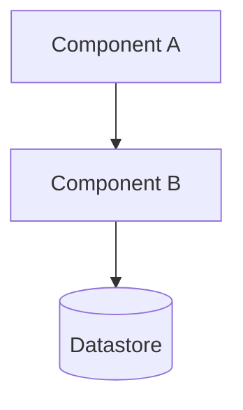

# {Project} - Architecture Reference

## Overview

One or two paragraphs: what the system does, who uses it, what it is *not*. Aim for the level of detail an engineer joining the project would need to orient themselves in five minutes.

This document captures the system's architectural boundaries, technology choices, and the reasoning behind them. It is intended as primary context for future engineering sessions.

## Core principles

The smallest set of load-bearing rules the architecture is built on - usually two or three. Each principle should be a sentence or two that future decisions can be checked against. If a principle is not actively used to settle design arguments, it does not belong here.

**1. {Principle name}.** {One paragraph explaining what it means and why it holds.}

**2. {Principle name}.** {...}

## Components

One subsection per component. For each: what it owns, what storage it uses, what it exposes, and what it explicitly does *not* know about. Keep entries short - link to deeper docs if needed.

### {Component A}
- **Owns:** ...
- **Storage:** ...
- **Exposes:** ...
- **Does not know about:** ...

### {Component B}
- ...

## System diagram

Keep the diagram in sync with the Components section. If they disagree, the prose wins and the diagram is wrong.

## Key decisions (with reasoning)

The decisions that shape the architecture, each stated together with the reason that justifies it. A bullet point without a rationale is worse than no bullet point.

- **{Decision}.** {Why this choice and not the obvious alternatives.}
- **{Decision}.** {...}

Cross-link to the corresponding ADR in `adr/` when one exists. The ADR is the canonical record; this list is the at-a-glance summary.

## Explicitly rejected alternatives

Options that were considered and rejected, with a short reason for each. This section exists so that re-proposing a rejected option triggers a check against the recorded reasoning instead of a fresh debate from zero.

- **{Alternative}.** {Why it was rejected.}
- **{Alternative}.** {...}

## Open questions

Live backlog of undecided design points. When a question is resolved, move it out of this section - either into "Key decisions" with the rationale, or into a dedicated ADR if the decision is significant enough.

- {Question - what would need to be true to decide either way?}
- {Question - ...}